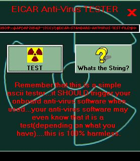



## eicar\-test

### Description

a simple way to test your onboard anti-virus software using the EICAR test string..which is totally harmless
 
### More Info
 

             |
---                |---
**Submitted On**   |2004-04-11 05:16:04
**By**             |[coderNH](https://github.com/Planet-Source-Code/PSCIndex/blob/master/ByAuthor/codernh.md)
**Level**          |Beginner
**User Rating**    |4.0 (8 globes from 2 users)
**Compatibility**  |VB 6\.0
**Category**       |[Miscellaneous](https://github.com/Planet-Source-Code/PSCIndex/blob/master/ByCategory/miscellaneous__1-1.md)
**World**          |[Visual Basic](https://github.com/Planet-Source-Code/PSCIndex/blob/master/ByWorld/visual-basic.md)
**Archive File**   |[eicar\-test1933599182005\.zip](https://github.com/Planet-Source-Code/codernh-eicar-test__1-62604/archive/master.zip)

